# Dashboard using NodeRED, InfluxDB and Grafana for the Air Quality Station

## Prérequis
* Installez Docker et Docker Compose

## Lancement

```bash
mkdir airqualitystation
cd airqualitystation
git clone https://github.com/airqualitystation/dashboard.git
cd dashboard

docker-compose up -d
docker-compose ps
docker-compose logs -f
```

## Configuration

Ouvrez les pages suivantes:
* http://localhost:1880 avec `admin` `MY_SUPER_ADMIN_SECRET`
* http://localhost:1880/ui avec `user` `MY_SUPER_USER_SECRET`
* http://localhost:1880/worldmap avec `user` `MY_SUPER_USER_SECRET`

Ouvrez la page suivante http://localhost:3000 et loggez vous avec `admin` `__SUPER_SECRET_TO_CHANGE__`

Configurez le/les brokers MQTT avec vos credentials (si c'est nécessaire).

## Extra

Commandes pour accéder aux shells des 3 conteneurs Docker
```bash
docker-compose exec -i nodered bash
docker-compose exec -i grafana bash
docker-compose exec -i influxdb bash

```
## Protocol TTN-NodeRED-InfluxDB-Grafana 

* Objective:
Following the success of sending the data to TTN, the communication prototype between TTN-NodeRED-InfluxDB-Grafana is established. All of these communications can be built via NodeRED-a flow-based development tool for visual programming originally developed by IBM to connect hardware devices, APIs and online services as part of the Internet of objects.

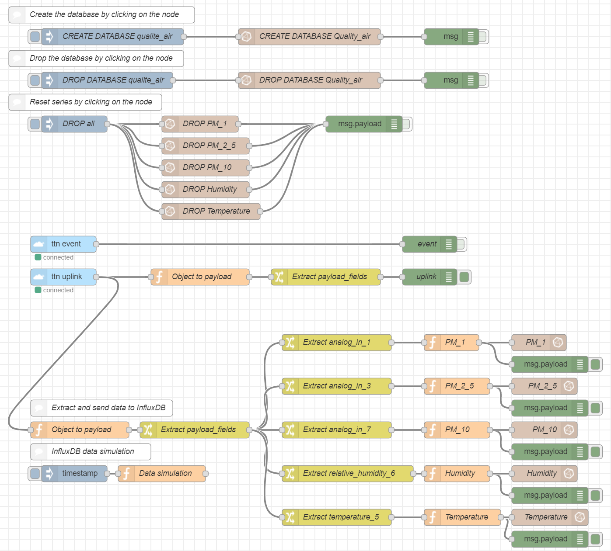
<p align="center">
  <i>Figure I.1: The flow completed</i>
</p>

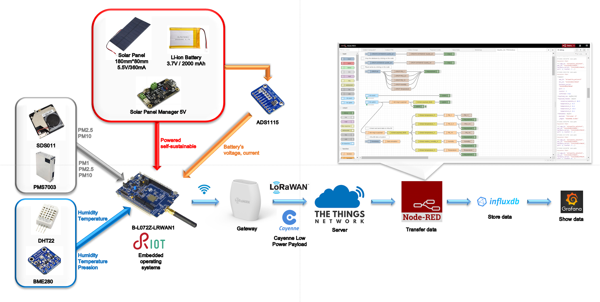
<p align="center">
  <i>Figure I.2: Protocol of cummunication</i>
</p>

* Communication between Cayenne and NodeRED:

On NodeRED, we use the “ttn” nodes:

ttn event: A node for receiving events from devices on The Things Network.

ttn uplink: A node for receiving uplink messages from devices on The Things Network.

ttn downlink: A node to send a downlink message to a device on The Things Network.

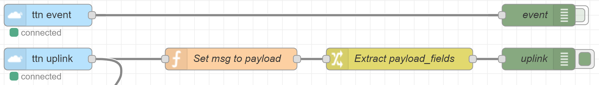
<p align="center">
  <i>Figure II.1: TTN nodes</i>
</p>

Configuration:

App ID: airquality_polytech

Access Key: ttn-account-v2.mXRfK4rBu8-YdEVpAGzfu8BWiZPFDAG8Z0hL6iETwSw

Discovery Address: discovery.thethingsnetwork.org:1900

Device ID: 3131353852378418

In this project, we only need to use the "ttn uplink" node to retrieve the data.

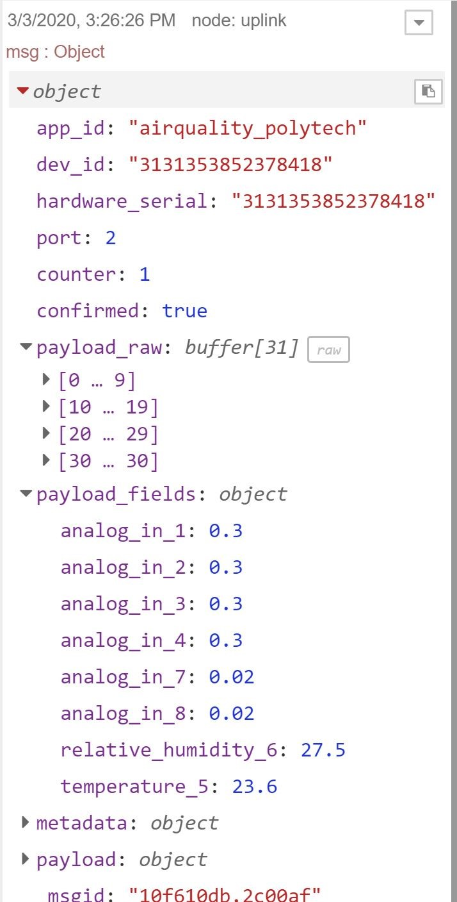
<p align="center">
  <i>Figure II.2: The message received by the TTN nodes</i>
</p>

* Communication between NodeRED and InfluxDB:
You can create the InfluxDB database on NodeRED by adding the specific nodes which allow you to perform basic queries on an influxdb time series database. By configuring on these nodes, one can choose between creating or canceling the desired database.
	
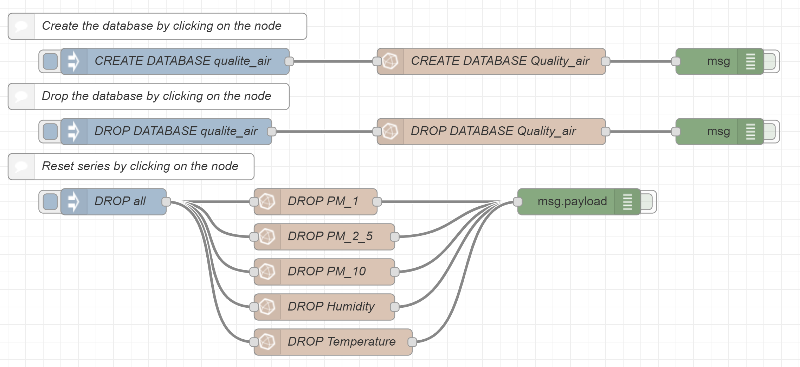
<p align="center">
  <i>Figure III.1: InfluxDB nodes</i>
</p>	

Configuration:

Host: influxdb

Port: 8086

Database: Quality_air

Query: 

CREATE DATABASE "Quality_air" WITH DURATION 60d REPLICATION 1 SHARD DURATION 1h NAME "sixty_days"

DROP DATABASE "Quality_air"

DROP MEASUREMENT PM_1

By clicking on the nodes “CREATE DATABASE” and “DROP DATABASE”, we will receive the corresponding messages below. With the same function, the “DROP” node is used to restart the series of data in the database.

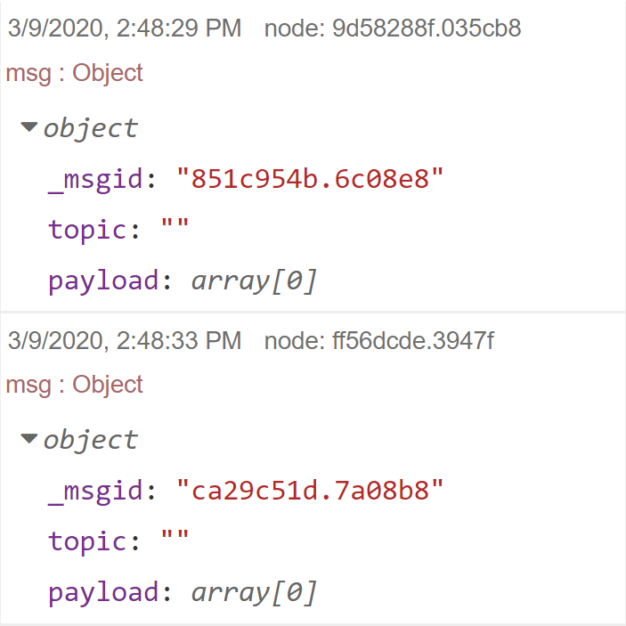
<p align="center">
  <i>Figure III.2: Messages received when creating an InfluxDB database</i>
</p>	


Because the message we receive is in the form "msg: Object" so we need to use the function node to change the message name "Set msg to payload" and from there we can extract the data that we want thanks to the change node “Extract payload_fields”. Once the message is extracted, we receive the result as below:

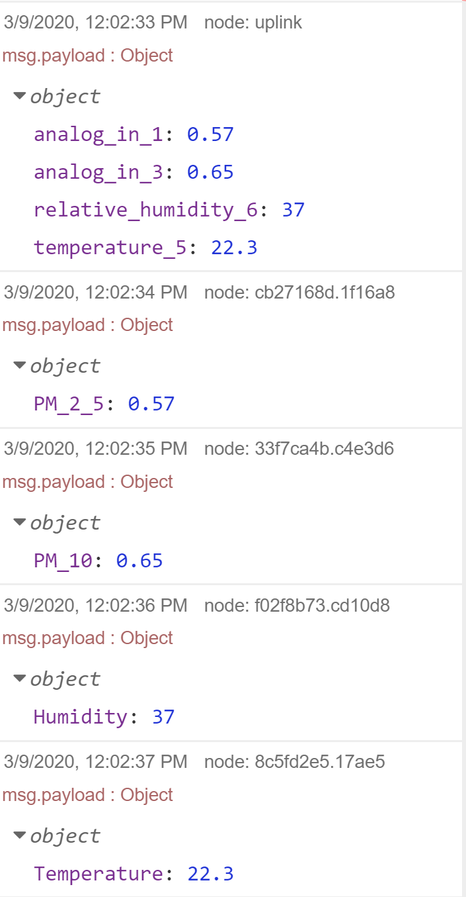
<p align="center">
  <i>Figure III.3: Messages sent to the InfluxDB database</i>
</p>	

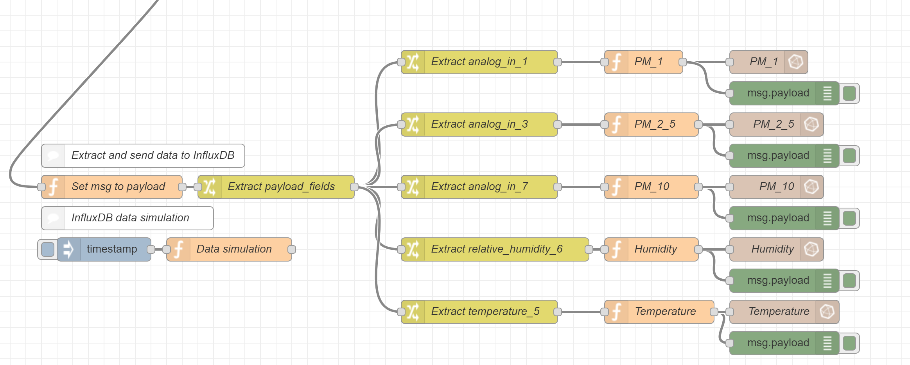
<p align="center">
  <i>Figure III.4: The nodes that send the messages to the InfluxDB database</i>
</p>	

Configuration:

Measurement: PM_1_QA

Next, we extract the value of each category, and we construct a message for each category in the form of "Object". Then, these messages are sent and saved on the "InfluxDB" database, in this case, the database is installed on the server of "https://air-quality.iot.imag.fr/".

* Communication between InfluxDB and Grafana:

On Grafana, you should not install Grafana on the personal PC because it is already installed on the server. In fact, you only need to create a “Data Sources” to retrieve the data from the InfluxDB data source and display them on “Dashboard”.
Here, we create a data source “InfluxDB” which contains a database “Quality_air”. Once you click on “Save and Test” and receive two displays “Database upload” and “Data source is working” which are well validated, the database is activated.

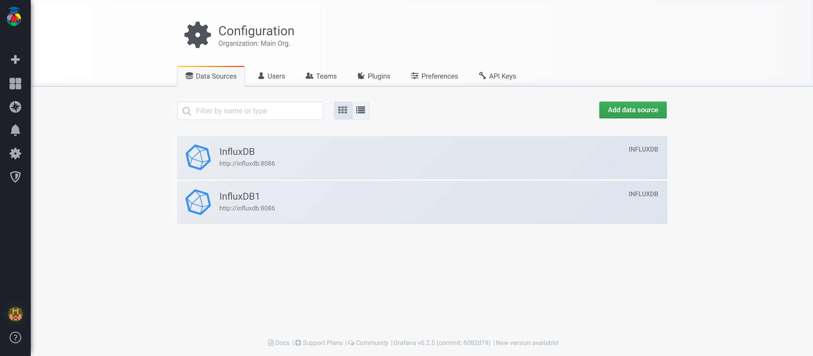
<p align="center">
  <i>Figure IV.1: Data sources for Grafana</i>
</p>	

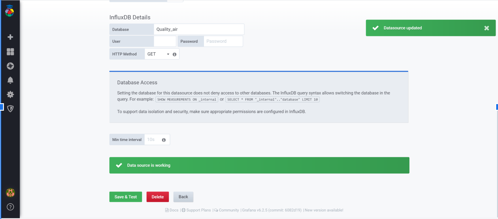
<p align="center">
  <i>Figure IV.2: Creating a data source</i>
</p>	

Finally, we create a “Dashboard” to display the data.

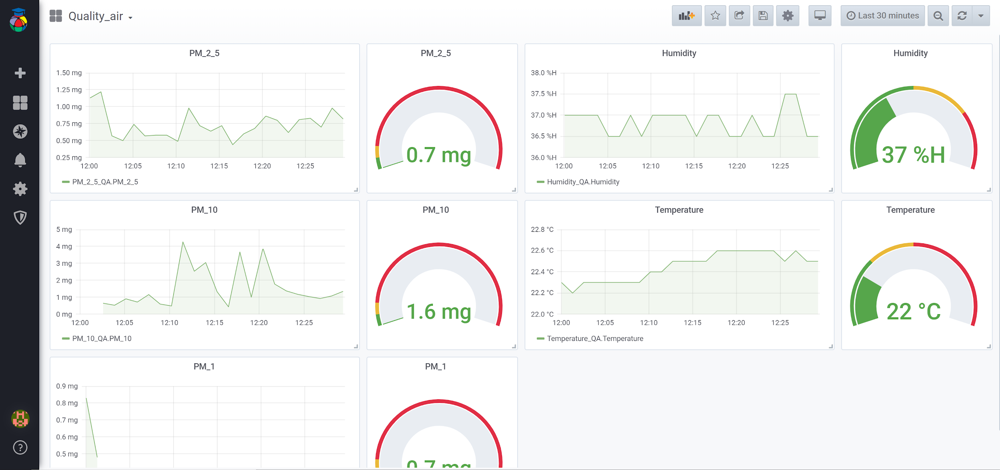
<p align="center">
  <i>Figure IV.3: The Grafana display</i>
</p>	

* Access:

The Grafana dashboard that we use to present the station and Polytech (MCF88) data:

https://air-quality.iot.imag.fr/
admin
E7534gx7Hp2TW679N34264

To customize the flow Nodered by integrating TTN:

https://air-quality-n.iot.imag.fr/
admin
f723aAA33emV6jv
